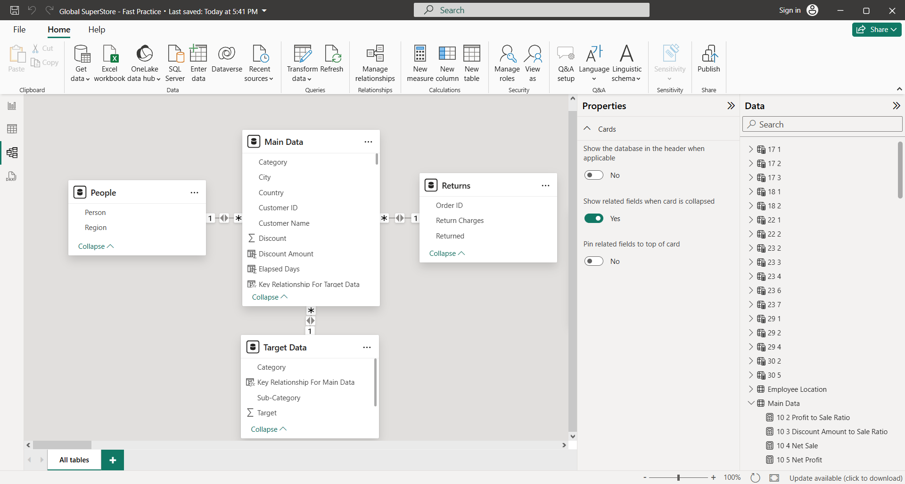
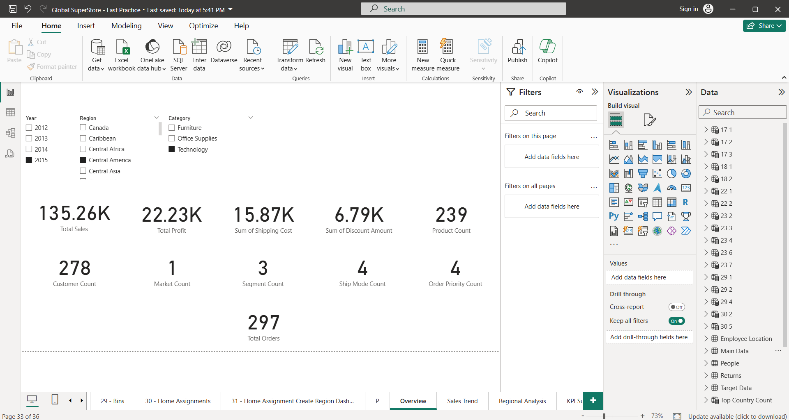
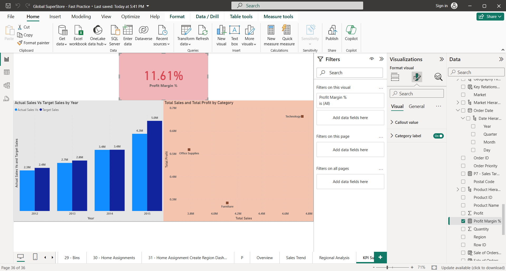
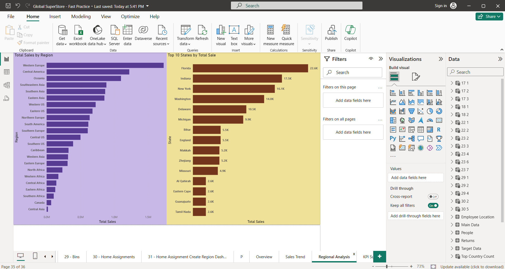
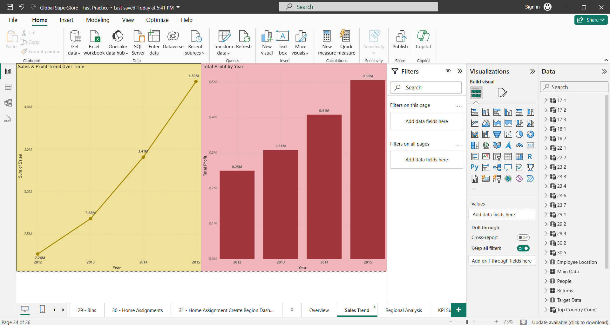

# Enterprise Sales Analytics & BI Reporting (Power BI)

## Project Overview
This project focuses on analyzing enterprise sales data using Power BI to provide actionable business insights.  
The dashboard covers sales performance, profitability, regional analysis, and KPI tracking.

## Tools & Technologies
- Power BI (DAX, Power Query)
- SQL (Data Analysis)
- Excel
- Data Modeling

---

## 1️⃣ Data Model

**Key Insights:**
- Designed a structured star-schema style data model with fact and dimension tables to support scalable reporting.
- Established clear relationships between Orders, Customers, Products, Regions, and Dates to ensure accurate aggregations.
- Optimized the model for Power BI performance and simplified DAX calculations.

---

## 2️⃣ Executive Overview

**Key Insights:**
- Provided a high-level snapshot of overall business performance using key metrics such as Total Sales, Total Profit, Orders, and Customers.
- Enabled quick decision-making through consolidated KPIs in a single dashboard view.
- Added interactive slicers (Year, Region, Category) for flexible analysis.

---

## 3️⃣ Sales Profit Trend

**Key Insights:**
- Analyzed year-wise sales and profit trends to identify growth patterns.
- Compared Actual Sales vs Target Sales to evaluate performance.
- Highlighted periods of strong and weak performance.

---

## 4️⃣ Regional Sales Analysis

**Key Insights:**
- Identified top-performing regions and states by sales contribution.
- Highlighted geographical sales concentration.
- Enabled regional comparison and drill-down analysis.

---

## 5️⃣ KPI Performance Summary

**Key Insights:**
- Tracked KPIs such as Profit Margin %, Sales vs Target, and Category contribution.
- Used conditional formatting to identify performance gaps.
- Supported management-level decision-making.

---

## Conclusion
This project demonstrates end-to-end BI development including data modeling, KPI design, and dashboard storytelling using Power BI.
